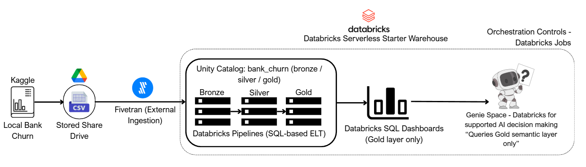

# Bank Churn Analytics on Databricks  
**Personal Project – Simulated Consulting Engagement**

---

## 1. Context & Objective

This is a personal analytics engineering project designed to **showcase practical Databricks capabilities** through a simulated consulting engagement with a **medium-sized local retail bank**.

The bank approaches an analytics consultant to help **understand and monitor customer churn** using an existing dataset stored as CSV files on a shared drive. Beyond solving the business problem, the project explicitly aims to demonstrate the ability to:

- Design and operate a Databricks Lakehouse
- Use Unity Catalog for project-level organisation
- Implement Bronze / Silver / Gold modeling
- Build and run Databricks Pipelines
- Deliver business-ready dashboards from a governed semantic layer
- Integrate Databricks-native AI exploration (Genie) on curated data

The objective is not to over-engineer, but to reflect how Databricks is realistically used in a consulting or in-house analytics context.

---

## 2. Business Understanding

### Business Problem

The bank has observed increasing customer attrition but lacks a clear and consistent way to answer questions such as:

- How severe is customer churn across the whole bank?
- Which customer segments are most affected?
- Are high-value or high-risk customers leaving disproportionately?

The bank owner does **not** want:
- Raw tables or spreadsheets
- Ad-hoc queries with inconsistent definitions
- Complex technical artifacts

They want:
- A **high-level executive view** of churn
- A **segment-level view** for commercial decision-making
- Metrics that can be discussed and iterated collaboratively

---

## 3. Data Understanding

### Data Source

The dataset used in this project is a **synthetic retail banking churn dataset** sourced from Kaggle:

- **Dataset**: *Vietnam Bank Churn Dataset 2025*  
- **Author**: Tran Huu Nhan  
- **Link**:  
  https://www.kaggle.com/datasets/tranhuunhan/vietnam-bank-churn-dataset-2025  

The dataset simulates customer behavior, financial profiles, engagement, and churn outcomes for a Vietnamese retail bank. While synthetic, the structure and business logic closely resemble real-world banking data.

The bank owner (simulated client) provides this dataset as CSV files on a shared drive, representing a common real-world scenario where data is not yet managed in a centralized database.

## Limitations

This analysis represents a **snapshot of the bank’s current customer base**.

Due to the absence of historical or time-series data:
- Trends over time cannot be evaluated
- Churn dynamics are assessed only at the current state
- Results should be interpreted as point-in-time indicators rather than longitudinal performance measures  

Future availability of historical data would allow deeper churn trend analysis and cohort-based insights.

---

### Data Structure

The dataset is **customer-level**, with one row per customer. Key categories include:

| Category | Description |
|------|-------------|
| Customer Identity | Customer ID, name, gender, age, marital status |
| Demographics | Occupation, province, residential district |
| Financial Profile | Monthly income, balance, credit score |
| Relationship | Tenure, number of cards, number of services |
| Engagement | Engagement score, loyalty level, digital behavior |
| Risk | Risk score, risk segment |
| Activity | Active member flag, last transaction |
| Target | Churn indicator (`exit`) |
| Segmentation | Business segment (Mass, Emerging, Affluent, Priority) |

The presence of both **personally identifiable information (PII)** and **banking behavior data** informs downstream modeling and governance decisions.

---

## 4. Agreed Analytics Scope

After reviewing the data with the bank owner, the scope is intentionally kept focused.

Two analytical deliverables are agreed:

1. **Overall Bank Churn Dashboard**  
   - Portfolio-level KPIs for executives

2. **Churn by Customer Segment Dashboard**  
   - Segment breakdown (Mass, Emerging, Affluent, Priority)

The understanding is that:
- These dashboards answer the first-order business questions
- Metric definitions must be consistent and transparent
- Additional analysis can be added later if required

---

## 5. Data Preparation & Architecture (Databricks Focus)

### Ingestion

- Source: CSV files on Google Drive (simulating a shared drive)
- Ingestion tool: Fivetran
- Output: A raw table landed inside Databricks

Once ingested, Databricks becomes the **single analytics platform**. Databricks Pipelines and Jobs do not depend on where the data originated.

---

### Data Validation & Exploratory Review (EDA)

Because the client did not have an existing data capability, an initial exploratory data analysis (EDA) was conducted after ingestion into Databricks and before finalising transformation logic.

**This exploratory review focused on:**

- Basic distribution checks (counts by segment and key categorical fields)

- Central tendency metrics (mean and median of balances, income, tenure, engagement, and risk scores)

- Identification of potential outliers for further investigation

**Important design decision:**
No outliers were removed or capped at this stage. All extreme values were deliberately retained to support further analysis and future business discussion. This reflects a realistic consulting approach where anomalies are first understood before any data cleansing decisions are applied.

This exploratory work was performed using **ad-hoc SQL queries and manual inspection and is not included in automated pipelines or jobs.**

### Lakehouse Design

This project uses a **Bronze / Silver / Gold** Lakehouse pattern implemented natively in Databricks.

A dedicated Unity Catalog is created:

- **Catalog**: `bank_churn`
- **Schemas**:
  - `bronze`
  - `silver`
  - `gold`

This structure isolates the project cleanly and mirrors enterprise Databricks deployments.

---

### Bronze Layer – Raw

- Object: `bank_churn.bronze.raw_customer`
- Implementation: a view over the Fivetran-ingested table
- Purpose:
  - Represent the raw source of truth inside the project catalog
  - No transformations or assumptions

---

### Silver Layer – Cleaned & Governed

To reflect real-world banking governance requirements, the Silver layer is **intentionally split**:

#### Silver – Customer Private Information
Contains **PII and sensitive attributes**, including:
- Name, gender, age, marital status
- Occupation, province, address
- Monthly income

**Governance note**:  
This dataset is designed to be protected by **Row-Level Security (RLS)** and restricted access in downstream tools. It is not intended for broad analytical use.

---

#### Silver – Customer Banking Information
Contains **banking, behavioral, and risk attributes**, including:
- Balance, credit score
- Tenure, cards, services
- Engagement and loyalty
- Risk scores and segments
- Activity flags
- Churn label

This dataset forms the **primary analytical base** for all Gold-layer metrics.

---

### Gold Layer – Business Semantic Layer

The Gold layer contains **only business-ready datasets**, designed for dashboards and AI exploration.

Two Gold views are created:

1. **Overall Churn KPIs**
   - Single-row portfolio snapshot

2. **Churn by Customer Segment**
   - Segment-level KPIs (one row per segment)

All KPI logic lives in the Gold layer. Dashboards do not compute metrics independently.

---

## 6. ETL Implementation (Databricks Pipelines)

**Data Quality Checks Pipeline**

In addition to transformation pipelines, a dedicated Data Quality (DQ) pipeline was established.

This pipeline performs automated validation checks on the ingested dataset, including:

- Null checks on critical identifiers

- Duplicate customer ID detection

- Non-negative validation for key numeric metrics

The pipeline produces a data quality summary table with a pass/fail flag.
**No records are modified or removed by this pipeline.**

This DQ pipeline is executed as part of the Databricks Job workflow and acts as a gate:
Silver and Gold layers are refreshed only if data quality checks pass.

This ensures that executive dashboards are never refreshed using invalid or structurally unsound data. Centralized, maintainable transformation logic

**ETL Implementation Pipelines**

- **Bronze layer**  
  Ingested raw customer data is exposed as a Bronze view, preserving the original structure and values without transformation.

- **Silver layer**  
  Bronze data is cleaned and logically separated into:
  - Customer private information (PII, governed for restricted access)
  - Customer banking and behavioral information  
  This layer standardises data types and prepares datasets for analytical use.

- **Gold layer**  
  Business-ready KPI datasets are created for dashboard consumption, including:
  - Overall bank-level churn KPIs
  - Churn KPIs grouped by customer segment  

Dependencies between layers are automatically managed and visualised by Databricks Pipelines, ensuring clear lineage from raw data to business outputs.

---

## 7. Orchestration (Databricks Jobs)

A Databricks **Job** orchestrates the full analytics workflow:

- Run the Data Quality checks pipeline

- Evaluate the data quality result

- Refresh the core Bronze → Silver → Gold transformation pipeline only if validation passes

- Refresh dashboards

This design enforces a clear separation between:

- Data validation (control layer)

- Transformation and analytics delivery

- Data ingestion via Fivetran is triggered manually to avoid exposing credentials in a public repository. The Job governs only internal analytics execution.

---

## 8. Business Insights & Value Delivered

### Using data from the dashboards:

#### Overall Bank Churn Status

- The bank is currently experiencing an approximate **18% churn rate**.  
- Based on general industry benchmarks, this suggests the bank is **small to moderately affected by churn**, although external industry-average data would be required for precise benchmarking.

#### Churn by Customer Segment Dashboard

Key observations include:

- The bank operates functionally with a **small proportion of high-loyalty customers**, who dominate balance exposure due to significantly higher deposits.  
  Despite representing a small share of customers, this group contributes a disproportionate share of total balances (average balances are approximately **6× higher than the lowest segment**).

- The **Mass customer segment** exhibits the **highest churn rate (approximately 40%)**.  
  - This segment contributes only about **6% of total deposits**
  - It shows the **highest average risk score (≈0.34)**
  - It represents the **second-largest customer group**, accounting for roughly **27% of total customers**

#### Business Implication

Given these patterns:
- Churn risk is concentrated in lower-balance, higher-risk customer groups
- Retention of high-value customers remains critical due to balance concentration
- A more **new-user-friendly acquisition and retention strategy**—such as bundled products or preferential introductory rates—may help reduce churn in the Mass segment

---

## 9. AI Exploration (Genie)

The Gold layer is exposed to **Databricks Genie Space** to enable natural-language Q&A, such as:

- “Which segment has the highest churn rate?”
- “How does average balance differ between Priority and Mass customers?”
- “What share of active users belong to each segment?”

Genie operates exclusively on the Gold semantic layer, ensuring:
- No exposure of raw or sensitive data
- Consistent KPI definitions
- Business-friendly interaction

---

## 10. Notes

- This project focuses on **Databricks usage, Lakehouse modeling, and analytics engineering**, not production ML systems.
- No credentials, API keys, or external configuration are included.
- The scope is intentionally constrained to demonstrate clarity, governance, and business alignment.
